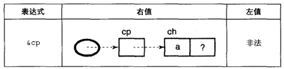
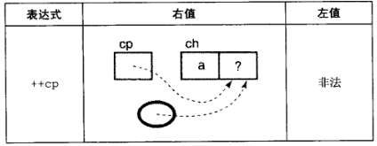
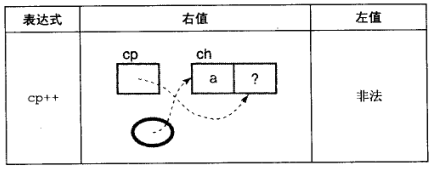

## **1. 内存和地址**


每个字可以容纳的无符号整数范围为从`0`到`(2^31-1)`，可以容纳的有符号证书的范围是从`-2147483648(-2^31)`到`2147483647(2^31-1)`

- 内存中的每个地址有一个独一无二的地址标识
- 内存中的每个位置都包含一个值
- 名字与内存位置之间的关联不是硬件提供的，他是由编译器为我们实现的。**硬件任然通过地址访问内存位置**


不能简单地通过检查一个值的位来判断它的类型，值的类型并非本身所固有的一种特性，而是取决于它的使用方式


变量被声明为指针并不会改变这些表达式的求值方式：一个变量的值就是分配给这个变量的内存位置所存储的值

## **2. 间接访问操作符**

通过一个指针访问它所指向的地址的过程称为`间接访问`或`解引用`。操作符是`*`

**指针变量的值就是一个数字**，指针并不存在内建的间接访问属性，除非表达式中存在间接访问操作符


```C
int a = 112; // 位置100
int *d = &a;
```

- `*d`的右值是112，位置100的内容，它的左值是位置100本身

## **3. 未初始化和非法指针**

```C
int *a; 
... 
*a = 12; 

// 创建了一个名叫a的变量，后面那条赋值语句把12存储于a所指在的位置
```

**我们声明了这个变量但是未对其初始化，没法预测12这个值将存储于何处**

**注意**：在对指针访问之前要先对指针进行初始化

## **4. NULL指针**

- 特殊的指针变量，不指向任何值。
- 要使一个指针为NULL，可以给他赋一个零值，为了测试一个指针变量是否为NULL，可以将它与零值进行比较
- 表示某个特定的指针并未指向任何东西
- 但是，用一个单一的值表示两种不同的意思是危险的事情，很容易无法分清哪个是真正的用意
  - 应对策略是：让函数返回两个独立的值
    - 首先是状态值，用于提示是否查找成功
    - 其次是指针，当状态值查找成功时，所指向的就是查找到的元素
- **对NULL指针解引用非法**，在对指针解引用之前，必须确保其并非是NULL指针
- 如果已经知道指针将被初始化为什么地址，就把他初始化为该地址，否则就将其初始化为NULL


## **5. 指针，间接访问和左值/变量**

- 间接访问操作符表示我们应该访问指针所指向的位置。

- **指针变量可以作为左值，不是因为他们是指针，而是因为他们是变量**，对指针变量进行间接访问表示应该访问指针所指向的位置，间接访问指定了一个特定的内存位置，这样便可以将间接访问表达式的结果作为左值使用

```c
int a;
int *d = &a;

*d = 10 - *d;
d = 10 - *d;
```

- 1行，右边的间接访问作为右值使用，该值是d所指向的位置所存储的值(a的值)。左边的间接访问为左值使用，d所指向的位置(a)把赋值符右侧的表达式的计算结果作为它的新值
- 2行，非法，表示把一个整形数量`(10-*d)`存储于一个指针变量中，**将整型值转换为指针，会报错**


```C
*&a=25; 
// 将值25赋值给a
```

- 首先，`&`操作符产生变量a的地址
- 然后，`*`操作符访问其操作数所表示的地址，操作数是a的地址，所以值25存储于a中

## **6. 指针常量**

```C
假设变量a存储于位置100

*100 =25;
// 错误，因为字面值100的类型是整型，而间接访问操作只作用于指针类型表达式

*(int *)100=25; 
// 强制类型转换将值100从  整型  转换为  指向整型的指针
```


## **7. 指针的指针**

```C
int a = 12;
int *b = &a;
```


```C
c = &b;
```


- c是一个指针的指针

```C
int **C;
```

- 表示**c 的类型是int


```C
int a = 12;
int *b = &a;
int **c = &b;
```

- `*`操作符具有从右向左的结合性
  - `**c`  相当于` *(*c)`

## **8. 指针表达式**

```C
char ch = 'a';
char *cp = &ch;
```


表达式`ch`作为右值使用时，值为`a`


粗椭圆提示`ch`的值就是表达式的值，当这个表达式作为左值使用时，他是这个内存的地址，而不是该地址包含的值


用粗方框表示这个位置就是表达式的结果。


- 作为右值，表示ch的地址
- 作为左值，&操作符的结果是个右值，不能当左值使用，不知道会存储于什么地方


- 右值就是cp的值
- 左值就是cp所处的内存位置



- 指针变量的地址，指向字符的指针的指针
- 值的存储位置未清晰定义，不是一个合法的左值


- `*`的优先级高于`+`，首先执行间接访问操作，得到(*cp)的值，取得该值拷贝并加1得到结果字符'b'
- 表达式存储位置不清晰，所以不是一个合法的左值


- 先指向加法运算，cp的地址+1，间接访问该地址内存
- 右值就是该地址的值
- **注意**：指针加法运算的结果是个右值，因为存储位置并未清晰定义，如果没有间接访问操作，表达式将不是一个合法的左值
- `*(cp+1)`可作为左值使用，`cp+1`本身不是左值，间接访问操作符是少数几个其结果为左值的操作符之一



- 表达式的结果是增值后的指针的一份拷贝，拷贝的存储位置未清晰定义，不是一个合法的左值



- 表达式的值是cp原来的值的一份拷贝


- 简介访问操作符作用域增值后的指针的拷贝上，右值是ch后面内存地址的值，左值就是那个位置本身


- 后缀++三个步骤，优先级表格中后缀++操作符的优先级高于`*`操作符
  - 1. ++操作符产生cp的一份拷贝
  - 2. ++操作符增加cp的值
  - 3. 在cp的靠背上指向间接访问操作


- 两个操作符都是从右到左，先执行的是间接访问操作，然后cp所指向的位置的值加1，表达式的结果是增值后的值的一份拷贝


- 结果是ch增值钱的原先值


- 先计算`*++cp`，然后将其结果值前缀++
- 这些操作符的接个性都是从右到左的，首先执行++cp，然后对该拷贝值间接访问*(++cp)，最后++操作，增加它的值


- 先后置++
- 间接访问操作符指向的位置是cp所指向的位置而不是cp所指向的位置的后面的位置
- 将前面结果前置++


## **9. 指针的运算**

- 当一个指针和一个整数量执行算数运算时，整数在执行家法运算之前始终会根据合适的大小进行调整。合适的大小是指指针所指向类型的大小，调整是把整数值与合适的大小相乘
- 两个指针相减得到的是两个指针在内存中的距离，减法运算的结果除以数组元素类型的长度
- 如果两个指针所指的不是同一数组种的元素，因为他们间的结果是未定义的


| 表达式 | 假定p是个指向…的指针 | 而且*p的大小是… | 增加到指针的值 |
| :----: | :------------------: | :-------------: | :------------: |
|  p+1   |         char         |        1        |       1        |
|  p+1   |        short         |        2        |       2        |
|  p+1   |         int          |        4        |       4        |
|  p+1   |        double        |        8        |       8        |
|  p+2   |         char         |        1        |       2        |
|  p+2   |        short         |        2        |       4        |
|  p+2   |         int          |        4        |       8        |
|  p+2   |        double        |        8        |       16       |

```C
#include<stdio.h>
int main()
{
    char *i ;
    int *t;
    double *c;
    long *a;
    long double *s;
    unsigned int *T; 
    printf("指针变量i的大小是% d\n", sizeof(*i));
    printf("指针变量t的大小是% d\n", sizeof(*t));
    printf("指针变量c的大小是% d\n", sizeof(*c));
    printf("指针变量a的大小是% d\n", sizeof(*a));
    printf("指针变量s的大小是% d\n", sizeof(*s));
    printf("指针变量T的大小是% d\n", sizeof(*T));

    printf("指针变量i的大小是% d\n", sizeof(i));
    printf("指针变量t的大小是% d\n", sizeof(t));
    printf("指针变量c的大小是% d\n", sizeof(c));
    printf("指针变量a的大小是% d\n", sizeof(a));
    printf("指针变量s的大小是% d\n", sizeof(s));
    printf("指针变量T的大小是% d\n", sizeof(T));
    return 0;
}
```

```
// 结果 64位环境下

指针变量i的大小是 1
指针变量t的大小是 4
指针变量c的大小是 8
指针变量a的大小是 8
指针变量s的大小是 16
指针变量T的大小是 4
指针变量i的大小是 8
指针变量t的大小是 8
指针变量c的大小是 8
指针变量a的大小是 8
指针变量s的大小是 8
指针变量T的大小是 8
```


### 算术运算

> 指针 士  整数	

只能用于指向数组中某个元素的指针，表达式的结果也是指针。适用于使用malloc函数动态分配获得的内存

> 指针  -   指针

只有当两个指针都指向同一数组中的元素是，才允许从一个指针减去连一个指针

两个指针相减的结果的类型是`ptrdiff_t`，是一种有符号整数类型。

减法运算的值是两个指针在内存中的距离（以数组元素的长度为单位，而不是以字节为单位），减法运算的结果将处以数组元素类型的长度

```C
// 例如
int *p1 = &array[i];
int *p2 = &array[j];

p2-p1 // 值是j-i
```

若两个指针所指向的不是同一数组中的元素，那么他们之间相减的结果是未定义的


### 关系运算

前提：两个指针指向同一数组中的元素


标准允许指向数组元素的指针与指向数组最后一个元素后面的内存位置进行比较，但是不允许与指向数组第一个元素之前的内存位置进行比较