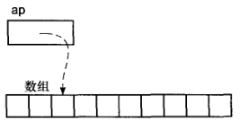
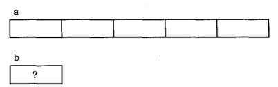
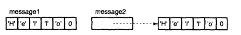
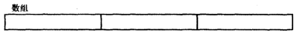
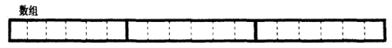
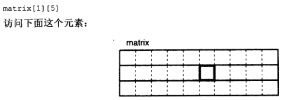
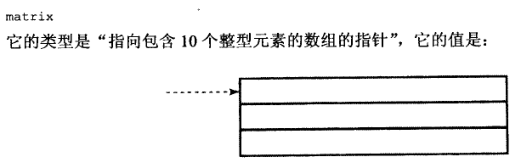
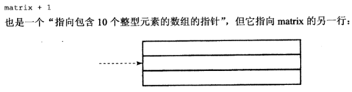
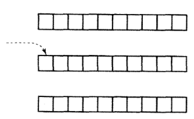
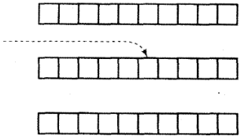

### 1. 一维数组

#### 1.1 数组名


- 数组名代表指向**XX类型**的**指针常量**，数组第一个元素的地址。类型取决于数组元素的类型
- 数组名的值是一个**指针常量**，也就是驻足第一个元素的地址
- 数组具有确定数量的元素，而指针只是一个标量值。只有当数组名在表达式中使用时变压器器才会产生一个指针常量。指针常量指向内存中数组的起始位置，不能修改常量的值，若修改指针常量就是把整个数组移动到内存的其它位置。但是，在程序完成链接后，内存中数组的位置是固定的，再想移动数组为时已晚。
- 在两种场合下，数组名不能用指针常量来表示：
  - 当数组名作为`sizeof`操作符或单目操作符`&`的操作数时。`sizeof()`返回整个数组的长度，而不是指向数组的指针的长度。
  - 取一个数组名的地址所产生的是一个指向数组的指针，而不是一个指向某个指针常量值的指针

```C
int a[10];
int b[10];
...
c = &a[0];
```

`&a[0]`是一个指向数组第一个元素的指针，与`c = a`任务相同

`b = a`非法，不能使用赋值符将一个数组的所有元素复制到另一个数组，必须使用循环，每次复制一个元素

`a = c`非法，a是常量指针，不能被修改


#### 1.2 下标引用

- 除了优先级之外，下标引用和间接引用访问完全相同

```C
array[idx] 
等价于 
*(array+(idx));
```

- 经过指针运算，加法运算的结果是一个指向所需元素的指针

```C
int array[10]; 
int *ap = array+2; 
```



- ap的对等表达式 array+2，&array[2]
- `*ap`的对等表达式array[2]，`*(array + 2)`
- ap[0]，C的下标引用和间接访问表达式是一样的，对等表达式是`*(ap+(0))`，去掉0和括号与上面的相同
- ap+6，若ap指向array[2]，加法运算产生的指针所指向元素是array[2]向后移动6个整数位置的元素，对等表达式是array+8和&array[8]
- `*ap+6`，间接访问先执行，其结果与6相加等价于 array[2]+6
- `*(ap+6)`等价于array[8]
- ap[6]与上面的相同
- &ap 没有对等的涉及array的表达式，无法预测编译器将ap放在相对于array的位置
- ap[-1]，负值的下标，下标引用就是间接访问表示，只要把它转换为那种形式并对其进行求值。ap指向第三个元素，使用偏移量-1使我们得到他的前一个元素array[1]
- ap[9]等价于array[11]，但是表达式越界了


```C
2[array]//合法
```

- 与*(array+2) 是相等的


#### 1.3 指针与下标

- 当在数组中1次1步的移动时，指针比下标更有效率

- 当你根据某个固定数目的增量在一个数组中移动的时候，使用指针变量将比使用下标产生效率更高的代码。当这个增量是1并且机器具有地址自动增量模型时，表现更突出


#### 1.4 指针的效率

- 声明为寄存器变量的指针通常比位于静态内存和堆栈中的指针效率更高
- 若可以通过测试一些已经初始化并经过调整的内容来判断循环是否应该终止，那就不需要使用一个单独的计数器
- 那些必须在运行时求值的表达式之诸如&array[SIZE]或者array+SIZE这样的常量表达式往往代价更高


#### 1.5 数组和指针

```C
int a[5]; 
int *b;
```



- 声明一个数组时，编译器将根据声明所指定的元素数量为数组保留内存空间，然后再创建数字名，它的值是一个常量，指向这段空间的起始位置
- 声明一个指针变量时，编译器只为指针本身保留内存空间，并不为任何整型值分配内存空间
- `*a`是合法的，`*b`非法，因为内存位置不确定
- b++可以通过编译，但是a++不行，因为a的值十一个常量


#### 1.6 作为函数参数的数组名

- 数组名的值就是指向数组第一个元素的指针，此时传递给函数的是一份该指针的拷贝
- 函数如果执行了下标引用，实际上就是对这个指针进行间接地访问操作，并且可以通过这种间接访问操作，函数可以访问和修改调用程序的数组元素

```C
char s1[]="hello"; 
char s2="Hello";
```

```C
// 字符串的复制
void strcpy(char *buffer, char const *string){
	// 重复复制字符，直到遇见NUL字节
	while( (*buffer++ = *string++) != '\0')
		;
}
```

#### 1.7 声明数组参数

```C
int strlen(char *string);
int strlen(char string[]);
```

- sizeof string的值是指向字符的指针的长度，而不是数组的长度
- 指针更加准确
- 形参只是一个指针，指向已经在其他地方分配好的内存空间
- 函数一维数组形参无需写元素数目，因为函数并不为数组参数分配内存空间


#### 1.8 初始化

- 数组的初始化类似于标量变量的初始化，取决于他们的存储类型，存储于静态内存的数组只初始化一次，在程序开始之前完成
- 自动变量缺省未初始化，位于运行时堆栈中
- 若声明中未给出数组的长度，编译器就把数组的长度设置为刚好能容纳所有的初始值的长度


- 当用于初始化一个字符数组是，是一个初始化列表
- 其他地方都表示字符串常量

```C
char message1[] = "Hello";
char message2 = "Hello";
```



- 前者初始化一个字符数组的元素，后者则是一个真正的字符串常量


### 2. 多维数组

#### 2.1 存储顺序

```c
int array[3];
```



```C
int array[3][6];
```



```C
int matrix[6][10];
int *mp;
...
mp = &matrix[3][8];
printf("%d\n", *mp);	// matrix[3][8]
printf("%d\n", *++mp);	// matrix[3][9]
printf("%d\n", *++mp);	// matrix[4][0]
```

在C中，多维数组的元素存储按照最右边的下标率先变化的原则，称为行主序

#### 2.2 数组名

```C
int matrix[3][10];
```

创建了matrix，可以看做是一个一维数组，包含3个元素，每个元素恰好是包含10个整型元素的数组

matrix这个名字的值是指向它第一个元素的指针，所以matrix是一个指向一个包含10个整型元素的数组的指针

#### 2.3 下标

```C
int matrix[3][10];
```





指向包含10个整型元故事的第1个子数组



```C
*(matrix+1);
```



```C
*(matrix+1)+5
```



对其进行间接访问`*( *(matrix + 1) + 5 )`访问的就是该位置的整型元素

```C
*(matrix[1]+5);
等价于
matrix[1][5];
```


#### **2.4 指向数组的指针**

```
int a[10], *p1=a; 
int b[3][10], *p2=b;
```


- 1正确，p1声明为一个指向整型的指针，并指向a的第一个元素
- 2不正确，p2是一个指向整形数组的指针
- p2应该被声明为如下形式：声明一个**指向整形数组的指针： int (\*p)[10]**
- 下标引用的优先级高于间接访访问，但是存在括号，先执行简介访问，所以p指向某种类型的数组，对p间接访问得到的是一个数组，对该数组进行下标引用操作得到一个整数值，所有p是一个指向整型数组的指针

```C
int (*p)[10]=b;
```

- p指向b的第1行


作为参数`void func(int **mat)`


初始化方式

```C
int m[2][3]={1,2,3,4,5,6};
```

```C
int m[2][3]={
			{1,2,3},
			{4,5,6}
}
```


### 3. 指针数组

```C
int *api[10]
```


- 下标引用优先级高于间接访问，先执行下标访问，所以api是某种类型的数组（包含元素个数是10）
- 再去的一个数组元素后，随即执行的是间接访问操作，对数组的某个元素进行间接访问操作后，得到一个整型值，所以api是个数组，他的元素类型是指向整型的指针

```C
char const *keyword[]={    
    "do",    
    "for",    
    "if",    
    "while",    
    "case" 
};
```

**sizeof计数数组个数**

```C
char const *keyword[]={    
    "do",    
    "for",    
    "if",    
    "while",    
    "case" 
}; 

#define N {sizeof(keyword)/sizeof(keyword[0])}
```

