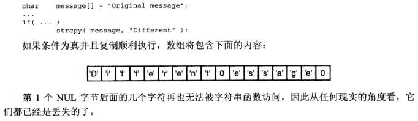

### **1. 字符串基础**

- 字符串就是一串另个或多个字符，并且以一个位模式全为0的NUL字节结尾
- NUL字节是字符串的终止符，但是本身不是字符串的一部分，所以字符串长度不包含NUL字节
- 头文件`<string.h>`

### **2. 字符串长度**

- 字符串长度即使它所包含的字符个数
- `size_t strlen(char const *str)`
- 注意该函数返回size_t的类型，定义在头文件stddef.h中，无符号整数类型

```C
if(strlen(x)>=strlen(y))   // 正常比较 

if(strlen(x)-strlen(y)>=0)  // 永远为真，因为是无符号的
```

- 如果将其强制转换为int，不会有这个问题

```C
#include <stddef.h>

size_t strlen( char *string ){
    int length ;
    for( length = 0; *string++ != '\0'; )
        length++;
    
    return length;
}
```

- strlen不包含'\0'
- sizeof包含'\0'


### **3. 不受限制的字符串函数**

#### **3.1 复制字符串**


`char *strcpy(char *dst, char const *src);`

- dst必须是个字符数组或者一个指向动态分配内存的数组的指针，不能使用字符串常量



- 程序员必须保证目标字符数组的空间足以容纳需要复制的字符串

#### **3.2 连接字符串**

`char *strcat(char *dst, char const *src);`

- 要求dst参数原先已经含有一个字符串（可以为空字符串）。
- 找到dst的结尾，并将src字符串的一份拷贝到这个位置，如果src和dst的位置发生重叠，结果是未定义的

#### **3.3 函数的返回值**

`strcpy`和`strcat`都返回它们第一个参数的一份拷贝，就是指向目标字符数组的指针，所以可以嵌套使用这些函数

#### **3.4 字符串的比较**

`int strcmp(char const *s1, char const *s)`

- s1<s2      <0
- s1>s2      >0
- s1==s2    =0

### **4. 长度受限的字符串函数**

```C
char *strncpy(char *dst, char const *src, size_t len); 
char *strncat(char *dst, char const *src, size_t len); 
int strncmp(char const *s1, char const *s2, size_t len);
```

- 如果strlen(src)>=len，那么只有len个字符被复制到dst中，**注意它的结果不会以NUL结尾**

```C
char buffer[BSIZE]; 
... 
strncpy(buffer, name, BSIZE); 
buffer[SBSIZE]='\0';
```

- 如果name长度小于buffer长度，第4行赋值语句没有效果
- 若name长度大于buffer长度，可以保证buffer中的字符是以NUL结尾的

- strcat总在结果字符串后面添加一个NUL字节

### **5. 字符串查找的基础**

#### **5.1 查找一个字符**

在一个字符串中查找一个特定字符最容易的方法是使用`strchr`和`strrchr`函数

```C
char *strchr(char const *str, int ch); 
char *strrchr(char const *str, int ch);
```

- 注意第二个位置是整型值，但是它包含了一个字符值。
- `strchr`在字符串中查找字符`ch`第一次出现的位置，找到函数返回一个指向该位置的指针，如果该字符并**不在**该字符串中，函数就**返回**一个**NULL指针**
- `strrchr`功能类似，但是返回的是**最后一次**出现的位置

#### **5.2 查找任何几个字符**

strpbrk，查找任何一组字符第一次在字符串中出现的位置

`char *strpbrk(char const *str, char const *group);`

该函数返回一个指向str中第一个匹配group中任何一个字符的字符位置。如果未找到匹配，函数返回一个NULL指针。

```C
char *str[20] = "Hello there, honey.";
char *ans;

ans = strbrk( str, "aeiou" );
```

- ans指向的位置是str+1，这个位置是第2个参数中的负第1次出现的位置，该函数区分大小写


#### **5.3 查找一个子串**

`char *strstr(char const *s1, char const *s2);`

- 在s1中查找整个s2第一次出现的位置，并返回一个指向该位置的指针，若没有找到，返回一个NULL指针。
- 若第二个参数是空字符串，函数就返回s1
- 查找最后一次出现的位置

```C
#include <string> 

char *my_strrstr(char const *s1, char const *s2) {    
    register char *last;    
    register char *current;        // 把指针初始化为我们已经找到的前一次匹配位置    
    last=NULL;        // 只有在第二个字符串不为空的时候查找，若为空，返回NULL    
    if(*s2 != '\0') {        // 查找s2在s1中第一次出现的位置        
        current = strstr(s1, s2);         
        // 我们每次找到字符串时，让指针指向它的起始位置，然后查找该字符串下一个匹配位置        
        while(current != NULL) {            
            last = current;            
            current = strstr(last+1, s2);        
        }    
    }    
    return last; 
}
```


### **6. 高级字符串的查找**

#### **6.1 查找一个字符串前缀**

`strspn`和`strcspn`函数用于在字符串的起始位置对字符计数

```C
size_t strspn(char const *str, char const *group); 
size_t strcspn(char const *str, char const *group);
```

- group字符串指定一个或者多个字符
- 函数用来计算字符串 str 中连续有几个字符都属于字符串 group

```C
#include <stdio.h> 
#include <stdlib.h> 
#include <string.h> 

int main () {   
    int i;   
    char str[] = "129th";   
    char accept[] = "1234567890";   
    i = strspn(str, accept);   
    printf("str 前 %d 个字符都属于 accept\n",i);   
    
    return 0; 
}
```

- 返回3


```C
strspn( buffer, "\n\r\f\t\v" );
```

- 指向字符串中的第一个非空白字符

- strcspn与strspn函数正好相反，对str字符串起始部分不与group中任何字符匹配的字符进行计数


#### **6.2 查找标记**

- 一个字符串尝尝包含几个单独的部分，为了将他们从字符中抽取出来，使用strtok函数
- 从字符串中隔离各个单独的称为标记（token）的部分，并丢弃分隔符

`char * strtok(char *s, const char *delim);`

- `strtok()`用来将字符串分割成一个个片段。参数s 指向欲分割的字符串，参数`delim `则为分割字符串，当`strtok()`在参数`s `的字符串中发现到参数`delim `的分割字符时则会将该字符改为`\0 `字符。在第一次调用时，`strtok()`必需给予参数`s `字符串，往后的调用则将参数`s `设置成NULL。每次调用成功则返回下一个分割后的字符串指针。
- **注意，strtok函数执行任务时，会修改他所处理的字符串**

```C
#include <stdio.h> 
#include <string.h> 

int main() {   

    char s[] = "ab-cd : ef;gh :i-jkl;mnop;qrs-tu: vwx-y;z";    
    char *delim = "-: ";    
    char *p;    
    printf("%s \n", strtok(s, delim));    
    while((p = strtok(NULL, delim))) { 	
        printf("%s ", p);        
        printf("\n"); 
    }   
    
    return 0; 
}
```

```
ab 
cd 
ef;gh 
i 
jkl;mnop;qrs 
tu 
vwx 
y;z 
```


```C
// 从参数中提取并打印
#include <stdio.h>
#include <string.h>

void print_token( char *line ){
	static char whitespace[] = " \t\f\r\v\n";
	char *token;
	
	for(token = strtok(line, whilespace); token!=NULL; token=strtok(NULL, whitespace))
		printf("Next token is %s \n", token);
}
```


### **7. 错误信息**

- 当调用一些函数，请求操作系统执行一些功能如打开文件时，如出现错误，通过设置一个外部的整形变量errno进行错误代码报告.
- strerror函数将其中一个错误代码作为参数并返回一个指向用于描述错误的字符串的指针

`char *strerror(int error_number);`

### **8. 字符操作**

标准库用于操作单独的字符的原型头文件`ctype.h`

#### **8.1 字符分类**

| **函数** | **若参数符合返回真**                                         |
| -------- | ------------------------------------------------------------ |
| iscntrl  | 任何控制字符                                                 |
| isspace  | 空白字符：空格‘ ’    换页'\f'   换行'\n'    回车'\r'   制表符'\t'   垂直制表符'\v' |
| isdigit  | 十进制0-9                                                    |
| isxdigit | 十六进制0-9   小写a-f   大写 A-F                             |
| islower  | 小写字母a-z                                                  |
| isupper  | 大写字母A-Z                                                  |
| isalpha  | 字母a-z,A-Z                                                  |
| isalnum  | 字母或者数字a-z,A-Z,0-9                                      |
| ispunct  | 标点符号                                                     |
| isgraph  | 图形符号                                                     |
| isprint  | 任何可打印字符，包括图形字符和空白字符                       |

**8.2 字符转换**

```C
int tolower(int ch); 
int toupper(int ch);
```

- 1返回对应的小写形式
- 2返回对应的大写形式

### **9. 内存操作**

以下这些函数在遇到NUL字节时并不会停止操作

### **9.1 memcpy**

```C
void* memcpy(char *strDest, const char *strSrc, int Count) {   
    if(strDest == NULL || strSrc == NULL || Count <= 0) 
        return NULL;   
    
    unsigned char *tempDest;   
    unsigned char *tempSrc;   
    tempDest = (unsigned char *)tempDest;   
    tempSrc = (unsigned char *)tempSrc;   
    
    while(Count--)   {     
        *tempDest = *tempSrc;     
        tempDest++;     
        tempSrc++;   
    }   
    
    return strDest; 
}
```


该函数原型实现中并没有考虑两个问题：

1、strDest与strSrc内存覆盖的问题；

2、Count的大小问题，正常的话Count的大小应该满足大于0而小于strSrc指向资源的大小，且小于strDest指向资源的大小。

对于问题1，解决办法如下：


```C
 void my_memcpy(void *dst,const void *src,size_t num){    
     //assert((dst!=NULL) && (src!=NULL) && (num>=0))    
     if(dst==NULL || src==NULL || num<0)      
         return;    
     if(dst==src)     
         return;    
     
     // convert to char type    
     char* pdst=(char*)dst;    
     const char* psrc=(const char*)src;    // memory overlap    
     if(pdst>psrc && pdst<psrc+num){      
         for(int i=num-1;i>=0;i--)        
             pdst[i]=psrc[i];    
     }    
     else{      
         for(size_t i=0;i<num;i++)        
             pdst[i]=psrc[i];    
     }  
 }


```


###  **9.2 memmove**

`memmove() `与 [`memcpy()`](http://c.biancheng.net/cpp/html/155.html) 类似都是用来复制 src 所指的内存内容前 num 个字节到 dest 所指的地址上。不同的是，memmove() 更为灵活，当src 和 dest 所指的内存区域重叠时，memmove() 仍然可以正确的处理，不过执行效率上会比使用 memcpy() 略慢些。

```C
void* memmove(void* dest, const void* src, size_t n) {    
    char*     d  = (char*) dest;   
    const char*  s = (const char*) src;      
    if (s>d)    {         
        // start at beginning of s         
        while (n--)           
            *d++ = *s++;    
    }    
    else if (s<d)    {        
        // start at end of s        
        d = d+n-1;        
        s = s+n-1;          
        
        while (n--)           
            *d-- = *s--;    
    }    
    return dest; 
}
```


### **9.3 memcmp**

`int memcmp (const void *s1, const void *s2, size_t n);`

- memcmp()用来比较s1 和s2 所指的内存区间前n 个字符。
- 若参数s1 和s2 所指的内存内容都完全相同则返回0 值。s1 若大于s2 则返回大于0 的值。s1 若小于s2 则返回小于0 的值。

### **9.4 memchr**

`void *memchr(const void *str, int c, size_t n) `

- 在参数 **str** 所指向的字符串的前 **n** 个字节中搜索第一次出现字符 **c**的位置

```c
#include <stdio.h>
#include <string.h>
 
int main ()
{
   const char str[] = "http://www.runoob.com";
   const char ch = '.';
   char *ret;
 
   ret = (char*)memchr(str, ch, strlen(str));
 
   printf("|%c| 之后的字符串是 - |%s|\n", ch, ret);
 
   return(0);
}
```

```
|.| 之后的字符串是 - |.runoob.com|
```


### **9.5 memset**

`void *memset(void *str, int c, size_t n) `

- 复制字符 **c**（一个无符号字符）到参数 **str** 所指向的字符串的前 **n** 个字符。
- `memset(buffer, 0, SIZE);` 把buffer的前SIZE个字节都初始化为0 