### **1. 结构体基础**

- 聚合数据类型能够同时存储超过一个的单独数据
- 数组是相同类型的元素的集合，他的每个元素是通过下标引用或指针间接访问来选择的
- 结构体也是一些值的集合，这些值称为**成员**，**但是一个结构体的各个成员可能具有不同的类型**
- 可以作为函数参数传递地给函数，也可以作为返回值从函数返回，也可声明指向结构体的指针

#### 1.1 结构声明

```C
struct tag {    
    member-list 
}variable-list; 
    
// 实例 
struct {    
    int a;    
    float b;    
    char c 
}x; // 声明创建可一个名叫x的变量 

struct{    
    int a;   
    float b;    
    char c; 
} y[20], *z; // 创建y包含20个该结构体，z是一个指针，指向这个类型的结构
```


- 以上两个声明被编译器当做完全不同的类型，即使他们的成员列表完全相同，变量y，z和x的类型不同，`z=&x`是非法的
- tag为成员列表提供了一个名字

```C
struct SIMPLE{    
    int a;   
    float b;    
    char c; 
}; 

struct SIMPLE x; 
struct SIMPLE y[20], *Z;

// 此时z=&x合法
```


- 使用typedef创建一种新的类型

```C
typedef struct{    
    int a;    
    char b;    
    float c; 
}Simple; 

Simple x; 
Simple y[20], *z;
```


#### 1.2 结构成员

- 结构体成员可以是标量、数组、指针甚至是其它结构

```C
struct COMPLEX{
	float	f;
    int 	a[20];
    long	*lp;
    struct	SIMPLE	s;
    struct 	SIMPLE	sa[10];
    struct	SIMPLE	*sp;
};
```


#### 1.3 结构成员的直接访问

- 结构体变量的成员通过**(.)**来访问
- 接受两个操作数，左操作数就是结构变量的名字，右操作数就是需要访问的成员的名字。
- 点操作符的结合性是从左到右


#### 1.4 结构成员的间接访问

- 若拥有一个指向结构体的指针，间接访问操作使用**（->）,**左操作数必须是一个指针


#### 1.5 结构体的自应用

- 在一个结构体内包含一个类型为该结构本身的成员是不合法的

```C
struct SELF_REF1 {    
    int a;    
    struct SELF_REF1 b;    
    int c; 
};    // 非法，成员b是另一个完整的结构，内部含有自己的b，会重复下去 

struct SELF_REF2 {    
    int a;    
    struct SELF_REF2 *b;    
    int c; 
}; // 合法，编译器在结构的长度确定之前就知道了指针的长度，所以合法
```


- 注意陷阱

```C
typedef struct{    
    int a;    
    SELF_REF3 *b;    
    float c; 
}SELF_REF3; 
// 因为类型名直到声明的末尾才定义，在结构体内的声明尚无定义
```

- 定义类型失败，解决方案如下

```C
typedef struct SELF_REF3_TAG {    
    int 	a;    
    struct SELF_REF3_TAG *b;    
    float 	c; 
} SELF_REF3;
```


#### 1.6 不完整的声明

多个结构体之间相互包含了其他结构体的一个或者多个成员

```C
struct B;

struct A{
	struct B *partner;
    ...
};

struct B{
    struct A *partner;
    ...
};
```

- A的成员列表张需要标签B的不完整声明，一旦A被声明之后，B的成员列表也可以被声明


#### 1.7 结构体的初始化

- 结构体的初始化与数组类似，一个位于花括号内部、由逗号分割的初始值列表可用于结构各个成员的初始化，注意根据成员列表顺序写出
- 如果初始列表的值不够，剩余的结构成员将使用默认初始化

```c
struct INIT_EX{
    int 	a;
    short	b[10];
    Simple	c;
}x={
	10,
    { 1, 2, 3, 4, 5 },
    { 25, 'x', 1.9}
};
```


### **2. 结构、指针和成员**

```C
typedef struct{    
    int a;    
    short b[2]; 
}EX2; 

typedef struct EX{    
    int a;    
    char b[3];    
    EX2 c;    
    struct EX *d 
}EX;
```


类型为`EX`的结构可用下图表示：

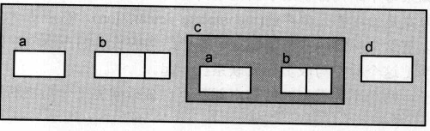

```C
EX x={10, "Hi", {5, {-1, 25}}}, 0; 
EX *px=&x;
```

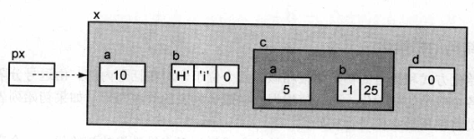

#### 2.1 访问指针

表达式px的右值是

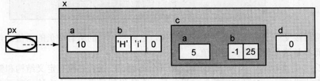

px是一个指针变量，但是此处不存在任何的间接访问操作符，这个表达式就是px的内容

该表达式的左值是

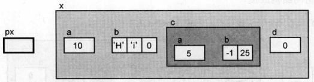

现实了px的旧值将被一个新值取代


- px+1，不是一个合法的左值，因为其值并不存储于任何可标识的内存位置，右值下一个未知


#### 2.2 访问结构

使用`*`操作符进行间接访问，表达式`*px`的右值是px所指向的整个结构

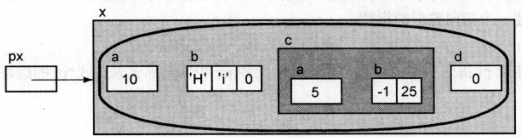

`*px`的左值是

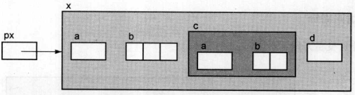

结构体将接受一个新值，将接受它的所有的成员的新值

- `*px+1`非法，`*px`的结果是一个结构体，C语言没有结构体与整型值之间的加法运算
- `*(px+1)`，由于x是一个标量，所以表达式非法


#### 2.3 访问结构成员

`px->a`的右值

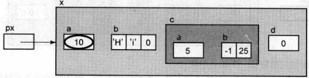

`->`操作符对px进行间接访问操作，首先得到所指向的结构，然后访问成员a

在表达式`*px`与`px->a`中，px所保存的地址都用于寻找这个结构。但是结构体的第一个成员是a，所以a的地址和结构体的地址是一样的。但是尽管两个地址值相同的，但是他们的类型不同，变量px被声明为一个指向结构的指针，所以*px的结果是整个结构，而不是第一个成员


```C
int *pi;

pi=px; // 非法，类型不匹配，可使用强制类型转换

pi=(int *)px; // 不安全

pi = &px->a;
// ->优先级高于&操作符的优先级，所以该表达式无需括号
```

`&px->a`的图为

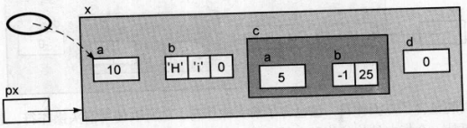

椭圆是直接指向成员a的，px指向整个结构，pi与px具有相同的值，但是类型不同，间接访问的结果也不一样：`*px`结果是整个结构，`*pi`的结果是一个单一的整型值


`px->b`的值是一个指针常量，因为b是一个数组，不是一个合法的左值，其右值为：

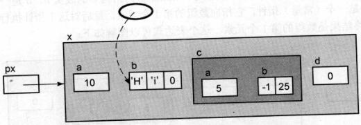

表达式`px->b[1]`示意图为

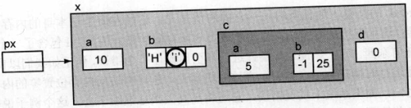


#### 2.4 访问嵌套的结构

`px->c`的左值是整个结构

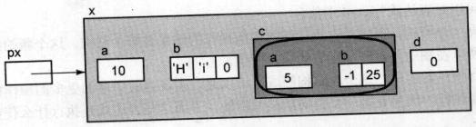

`px->c.a`具有以下右值

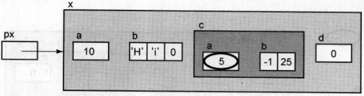

`*px->c.b`

- 首先执行`->`操作符，`px->c`的结果是结构c
- 增加`.b`访问结构c的成员b，b是一个数组，`px->b.c`是一个常量指针，指向该数组第一个元素
- 最后间接访问，结果就是数组的第一个元素

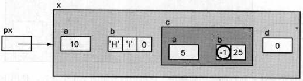


#### 2.5 访问指针成员

`px->d`的右值是0，左值是本身的内存位置

`*px->d`间接访问操作符作用于成员d所存储的指针值，但是d为NULL，不指向任何东西，对NULL解引用操作是个错误

```C
Ex	y;
x.d = &y;
```

现在对`*px->d`求值，d指向一个结构，对其间接访问的操作的结果是整个结构

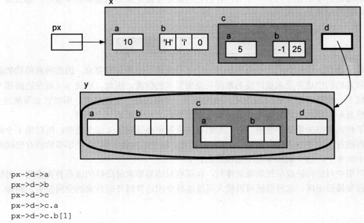

最后一个表达式的右值可图解为

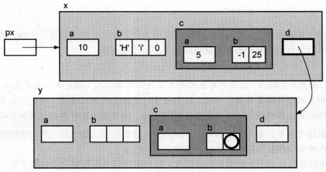


### **3. 结构体的存储分配**

只有当存储成员需要满足边界对齐要求时，成员之间才可能出现用于填充的额外内存空间

```C
struct ALIGN{    
    char a;    
    int b;   
    char c; 
};
```


- 如果机器的整型值长度为4个字节，并且他的其实存储位置必须能被4整除，那么这个结构在内存中的存储如下所示：

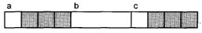

如果要确定结构体中某个成员的实际位置

```C
offset(type, member); 
// 结果是size_t的值，表示指向成员开始存储的位置距离结构开始存储的位置偏移几个字节

offset(struct ALIGN, b); //结果为4
```


### 4. 作为函数参数的结构

尽量用结构体指针作为函数参数

### **5. 位段**

- 与结构体类似，他的成员是一个或多个位的字段
- 这些不同长度的字段实际存储于一个或多个整形变量中
- 位段的声明必须为`int, signed int, unsigned int`
- 成员名的后面是一个**冒号**和一个**整数**，这个整数指定该位段所**占用的位的数目**

```C
struct CHAR{    
    unsigned ch :7;    
    unsigned font :6;    
    unsigned size :19; 
}; 

struct CHAR ch1;
```

- 当一个声明指定了两个位段，第2个位段比较大，无法容纳与第一个位段的剩余的位时，编译器有可能把第2个位段放在内存的下一个字，也可能直接放在第1个位段的后面

32位机器上，有下面两种可能创建ch1

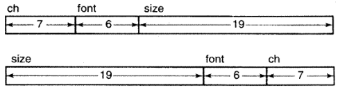

- 可以将长度为奇数的数据包装在一起，节省存储空间


### **6. 联合体**

- 联合体的所有成员引用的都是**内存中相同的位置**
- 想在不同时刻把不同的东西存在相同的位置，用联合体

```C
union {    
    float f;    
    int i; 
}fi; 

fi.f=3.14; 
printf("%d\n", fi.i);
```


- 把3.14的浮点数表示形式存储于fi，然后把这些相同的位当做一个整型值打印输出

- 在一个成员长度不同的联合体中，分配给联合体的内存数量取决于它的最长成员的长度
- 为了解决成员长度差距悬殊问题，在联合体中存储指向不同成员的指针而不是直接存储成员本身

- 联合体可以被初始化，但是初始值必须是联合体的第一个成员的类型

```C
union{
	int 	a;
	float 	b;
	char 	c[4];
}x={5};
```

x.a初始化为5