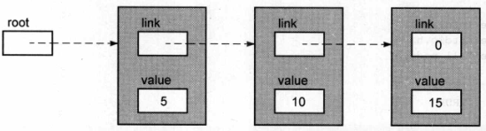

### **1. 单链表节点**



```C
typedef struct NODE{    
    struct NODE *next;    
    int value; 
}Node;
```


**将一个结点插入到有序的单链表**

```C
#include <stdlib.h>
#include <stdio.h>
#include "sll_node.h"

#define 	FALSE 	0
#define 	TRUE 	1

int sll_insert( Node **rootp, int new_value ){
	Node *current;
    Node *previous;
    Node *new;
    
    // 指向第一个节点的指针
    current = *rootp;
    previous = NULL;
    
    // 寻找正确的插入位置
    while(current!=NULL && current->value < new_value ){
        previous = current;
        current = current->link;
    }
    
    // 为新节点分配内存
    new = (Node *)malloc( sizeof(Node) );
    if( new == NULL )
        return FALSE;
    new->value = new_value;
    
    // 将新节点插入到链表中，返回TRUE
    new->link = current;
    if( previous == NULL )
        *rootp = new;
    else
	    previous->link = new;
    
    return TRUE;
}
```

```C
#include <stdlib.h>
#include <stdio.h>
#include "sll_node.h"

#define 	FALSE 	0
#define 	TRUE 	1

int sll_insert( register Node **rootp, int new_value ){
	register Node *current;
    Node *new;
    
    // 寻找正确的插入位置
    while( (current = *linkp)!=NULL && current->value<new_value ){
        linkp = &current->link;
    }
    
    // 为新节点分配内存
    new = (Node *)malloc( sizeof(Node) );
    if( new == NULL )
        return FALSE;
    new->value = new_value;
    
    // 将新节点插入到链表中，返回TRUE
    new->link = current;
    *linkp = new;
    
    return TRUE;
}
```


### **2. 双链表节点**

```C
typedef struct NODE{    
    struct NODE *pre;    
    struct NODE *next;    
    int value; 
}NODE;
```


#### **创建一个新的节点**

```C
NODE *new_node; 
new_node=(NODE*)malloc(sizeof(NODE)); 
new_node->value=val;
```


#### **在双链表中插入**

- 中间位置
- 起始位置
- 结束位置
- 原链表为空

```C
// 双链表插入简明实现
#include <stdlib.h>
#include <stdio.h>
#include "double_linked_list_node.h"

int dll_insert( Node *rootp, int value ){
    Node *this;
    Node *next;
    Node *newnode;
    
    for( this = rootp; (next = this->fwd)!=NULL; this = next){
        if( next->value == value ){
            return 0;
        }
        if( next->value > value ){
			break;
        }
    }
    newnode = (Node *)malloc( sizeof( Node ));
    if( newnode == NULL )
        return -1;
    newnode->value = value;
    
    if(next!=NULL){
        // 并非位于尾部
        if( this != rootp ){	// 1. 并非位于链表起始位置
            newnode->fwd = next;
            this->fwd = newnode;
            newnode->bwd = this;
            next=>bwd = newnode;
        }
        else{	// 2. 位于链表的起始位置
            newnode->fwd = next;
            rootp->fwd = newnode;
            newnode->bed = NULL;
            next->bwd = newnode;
        }
    }
    else{
        // 位于链表的尾部
        if(this != rootp){	// 3. 位于链表的尾部
            newnode->fwd = NULL;
            this->fwd = newnode;
            newnode->bwd = this;
            rootp->bwd = newnode;
        }
        else{	//4. 位于链表的起始位置
        	newnode->fwd = NULL;
            rootp->fwd = newnode;
            newnode->bwd = NULL;
            rootp->bwd = newnode;
        }
    }
    return 1;
}
```

```C
// 双链表插入简明实现
#include <stdlib.h>
#include <stdio.h>
#include "double_linked_list_node.h"

int dll_insert( Node *rootp, int value ){
    Node *this;
    Node *next;
    Node *newnode;
    
    for( this = rootp; (next = this->fwd)!=NULL; this = next){
        if( next->value == value ){
            return 0;
        }
        if( next->value > value ){
			break;
        }
    }
    newnode = (Node *)malloc( sizeof( Node ));
    if( newnode == NULL )
        return -1;
    newnode->value = value;
    
    if(next!=NULL){
        // 并非位于尾部
        newnode->fwd = next;
        if( this != rootp ){	// 1. 并非位于链表起始位置
            this->fwd = newnode;
            newnode->bwd = this;
        }
        else{	// 2. 位于链表的起始位置
            rootp->fwd = newnode;
            newnode->bed = NULL;
        }
        next->bwd = newnode;
    }
    else{
        // 位于链表的尾部
        newnode->fwd = NULL;
        if(this != rootp){	// 3. 位于链表的尾部
            this->fwd = newnode;
            newnode->bwd = this;
        }
        else{	//4. 位于链表的起始位置
            rootp->fwd = newnode;
            newnode->bwd = NULL;
        }
        rootp->bwd = newnode;
    }
    return 1;
}
```

````C
// 双链表插入简明实现
#include <stdlib.h>
#include <stdio.h>
#include "double_linked_list_node.h"

int dll_insert( register Node *rootp, register int value ){
    register Node *this;
    register Node *next;
    register Node *newnode;
    
    for( this = rootp; (next = this->fwd)!=NULL; this = next){
        if( next->value == value ){
            return 0;
        }
        if( next->value > value ){
			break;
        }
    }
    newnode = (Node *)malloc( sizeof( Node ));
    if( newnode == NULL )
        return -1;
    newnode->value = value;
    
    // 插入新节点
    newnode->fwd = next;
    this->fwd = newnode;
    
    if(this!=rootp)
        newnode->bwd = this;
    else
        newnode->bwd = NULL;
    
    if(next!=NULL)
        next->bwd = newnode;
    else
        rootp->bwd = newnode;
    
    return 1;
}
````

