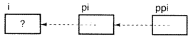

### **1. 指向指针的指针**

```C
int i; 
int *pi; 
int **ppi; 

printf("%d\n", ppi); 
printf("%d\n", &ppi); 
*ppi=5;
```

- 5 如果ppi是个自动变量，未被初始化，打印一个随机值，若是一个静态变量，打印0
- 6 把存储ppi的地址打印出来
- 7 结果未知，因为ppi尚未被初始化

```C
ppi=&pi
```

把ppi初始化为指向变量pi，之后便可以安全的对ppi执行间接访问操作了

```C
*ppi=&i;
```

这条语句把pi（通过ppi间接访问）初始化为指向变量i



之后，下面的各条语句效果相同

```C
i='a'; 
*pi='a'; 
**ppi='a';
```


### **2. 高级声明**

```C
int f;   // 一个整形变量 
int *f;  // 一个指向整型的指针
```

- 把`表达式*f`声明为一个整数，从而推断`f`是一个`指向整型的指针`


```C
int f();
```

- f声明为一个函数，它返回的是一个整数


```C
int *f();
```

- 返回一个指向整型的指针，`()优先级高于*`，所以`f是一个函数`，返回值是一个指向整型的指针


```C
int (*f)()
```

- 第2对括号是函数调用操作符，第一个括号起到聚组的作用。
- 使间接访问在函数调用之前进行，使`f称为一个函数指针`，所`指向`的函数`返回一个整型值`
- 程序中的每个函数都位于内存中的某个位置，所以存在指向那个位置的指针是完全可能的


```C
int *(*f)()
```

- `f也是一个函数指针`，指向的函数的返回值是一个整型指针，必须间接访问才能得到一个整型值


```C
int f[];
```

- 声明`f是一个整型数组`


```C
int *f[];
```

- `下标的优先级更高`，所以`f是一个数组`，元素是指向整型的指针


```C
int f()[];
```


- f是一个函数，返回的是一个整型数组。
- 此声明是非法的，函数只能返回标量值，不能返回数组


```C
int f[]();
```

- f似乎是一个数组，元素类型是返回值为整型的函数
- 此声明`非法`，因为**数组元素必须具有相同的长度，但是不同的函数可能具有不同的长度**


```C
int (*f[])();
```

- 声明合法
- 括号内的`*f[]`首先进行求值，所以`f是一个元素为某种类型的指针的分组`
- `表达式后的()是函数调用操作符`，所有`f肯定是一个数组`，数组`元素`的`类型`是`函数指针`，所指指向的函数的返回值是一个整型值


```C
int *(*f[])();
```

- 创建了一个指针数组，指针所指向的类型是返回值为整型指针的函数


```C
int (*f)(int, float); 
int *(*g[])(int, float);
```

- f声明为一个函数指针，返回一个整型值
- g声明为一个数组，数组的元素类型是一个函数指针，返回一个整型指针


### **3. 函数指针**

常用用途

- 转换表
- 作为参数传递给另一个函数

**注意对函数指针进行间接访问操作之前必须把它初始化为指向某个函数**

```C
int f(int); 
int (*pf)(int)=&f;
```

- 其中初始化表达式中的`&`是`可选`的，因为**函数名**被使用的时候总是由编译器将其转化为**函数指针**
- `&`只是显示的说明了编译器将隐式执行的任务

函数指针在初始化后，使用三种方式调用函数

```C
int ans; 

ans=f(25); 
ans=(*pf)(25); 
ans=pf(25);
```

- 3 中函数名f首先被转换为一个函数指针，该指针指定函数在内存中的位置，然后函数调用操作符调用该函数，开始执行这个地址的代码
- 4 对pf执行间接访问操作，把函数指针转换为函数名，效果和3一样
- 5 与前两句效果一样


#### **3.1 回调函数**

- 用户把一个函数指针作为参数传递给其他函数，后者将“回调”用户的函数
- 不知道函数参数类型，解决办法就是把参数类型声明为void*，表示一个指向未知类型的指针
- 在比较函数中的指针使用之前，必须被强制转换为正确的类型

```C
// 与类型无关的链表查找 
#include <stdio.h> 
#include "node.h" 

Node* search_list(Node *node, void const *value, int (*compare)(void const *, void const *)) {    
    while(node!=null)    {        
        if(compare(&node->value, value)==0)            
            break;        
        node=node->next;    
    }    
    return node; 
}
```

```C
int compare_ints(void const *a, void const *b) {    
    if( *(*int *)a == *(int *)b )        
        return 0;    
    else        
        return 1; 
}

deslred_node = search_list(root, &desired_value, compare_ints);
```


#### **3.2  转移表**

```C
// 计算器 
switch(oper){    
    case ADD:        
        res=add(op1, op2);        
        break;    
    case SUB:        
        res=sub(op1, op2);        
        break;    
    case MUL:        
        res=mul(op1, op2);        
        break;    
    case DIV:        
        res=div(op1, op2);        
        break;    
	... 
}
```

- 转换表就是一个函数指针数组


**创建一个转换表：**

1. 声明并初始化一个函数指针数组，确保这些函数的原型出现在这个数组的声明之前

```C
double add(double, double); 
double sub(double, double); 
double mul(double, double); 
double div(double, double); 
... 
double (*oper_func[])(double, double)={add, sub, mul, div, ...};
```

2. 用下面语句替换前面的switch语句

```C
res=oper_func[oper](op1,op2);
```

oper从数组中选择正确的函数指针，而函数调用操作符将执行这个函数

### **4. 命令行参数**

#### **4.1 传递命令行参数**

C的main函数有两个形参。

- 第一个是`argc`，表示命令行`参数的数目`，第2个称为`argv`，指向`一组参数值`。
- 由于参数的数目没有内在的限制，所以argv指向这组参数值（本质上是一个数组）的第一个元素，这些元素的每个都是指向一个参数文本的指针

int main(int argc, char **argv) { }


- 注意指针数组：这个数组的每个元素都是一个字符指针，数组的末尾是一个NULL指针。
- argc和NULL值都用于确定实际传递了多少个参数
- argv的第一个参数是程序的文件名，指向数组的第1个元素

```C
// 打印参数 
#include <stdio.h> 
#include <Stdlib.h> 
int main(int argc, char **argv) {    
    while(*++argv!=NULL)        
        printf("%s\n",*argv);    
    return EXIT_SUCCESS; 
}
```


#### **4.2 处理命令行参数**

在程序名的后面，可能有另个或多个选项，后面跟有另个或者多个文件名

`prog -a -b -c name1 name2 name3`

```C
#include <stdio.h> 
#define TRUE 1 

void process_standard_input(void); 
void process_file(char *file_name); 

int option_a, option_b; 

void main(int argc, char **argv) {    
    // 处理选项参数：调到下一个参数并检查它是否以一个横杠开头    
    while(*++argv!=NULL && **argv=='-')    {        
        //检查横线后面的字母        
        switch(*++*argv)        {            
            case 'a':                
                option_a=TRUE;                
                break;            
            case 'b':                
                option_b=TRUE;                
                break;        
        }    
    }        
    
    // 处理文件名参数    
    if(*argv==NULL)        
        process_standard_input();    
    else        
        do{            
            process_file(*argv);        
        }while(*++argv!=NULL); 
}
```

```C
prog -abc name1 name2 name3

while(( opt=*++*agrv ) != '\0' ) {    
    switch(opt){        
        case 'a':            
            option_a=TRUE;            
            break;        
        /*etc*/    
    } 
}
```


#### getopt()函数

头文件 #include <unistd.h>

定义函数：int getopt(int argc, char * const argv[], const char * optstring);

函数说明：getopt()用来分析命令行参数。
1、参数argc 和argv 是由main()传递的参数个数和内容。
2、参数optstring 则代表欲处理的选项字符串。

此函数会返回在argv 中下一个的选项字母，此字母会对应参数optstring 中的字母。

如果选项字符串里的字母后接着冒号":"，则表示还有相关的参数，全域变量optarg 即会指向此额外参数。
如果getopt()找不到符合的参数则会印出错信息，并将全域变量optopt 设为"?"字符, 如果不希望getopt()印出错信息，则只要将全域变量opterr 设为0 即可。

返回值：如果找到符合的参数则返回此参数字母, 如果参数不包含在参数optstring 的选项字母则返回"?"字符,分析结束则返回-1.

范例

```C
#include <stdio.h>
\#include <unistd.h>
int main(int argc, char **argv)
{
  int ch;
  opterr = 0;
  while((ch = getopt(argc, argv, "a:bcde")) != -1)
  switch(ch)
  {
   case 'a':
     printf("option a:'%s'\n", optarg); break;
   case 'b':
     printf("option b :b\n");  break;
   default:
     printf("other option :%c\n", ch);
  }
  printf("optopt +%c\n", optopt);
}

执行：
$. /getopt -b
option b:b
$. /getopt -c
other option:c
$. /getopt -a
other option :?
$. /getopt -a12345
option a:'12345'
```


### **5. 字符串常量**

- 当一个`字符串常量出现于表达式中`是，他的`值就是指针常量`
- 编译器把这些指定字符存储于内存中的某个位置，并存储一个指向第1个字符的指针
- `数组名用于表达式中是，值也是指针常量`

```C
"xyz"+1 
```

 指针值加上1的值，结果是个指针，指向第2个字符y

```V
*"xyz"
```

 对一个指针进行间接访问操作，结果就是指针指向的内容 

结果就时所指向的字符x，结果并不是整个字符串而是第一个字符

```C
"xyz"[2]
```

值是z

```C
*("xyz" + 4)
```

超出字符串的范围，不可预测的字符


- 十六进制

```C
res=value%16; 
if(res<10)    
    putchar(res+'0'); 
else    
    putchar(res-10+'A');
```

```C
putchar("0123456789ABCDEF"[value%16]);
```


- 余数是0-15的值，使用下标从字符串常量中选择一个字符打印

```C
#include<stdio.h> 

void printstar(int n) {    
	n+=5;    
    n/=10;    
    printf("%s\n", "**********"+10-n); 
}
```

- n=0 打印0个*
- n=100 打印10个*