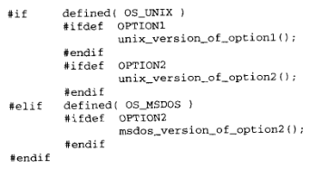

编译一个C程序第一步骤就是预处理阶段

主要任务就是：

- 删除注释
- 插入被#include指令包含的文件的内容
- 定义和替换由#define指令定义的符号以及确定代码的部分内容是否应该根据一些条件编译指令进行编译

### **1. 预定义符号**

| **符号**   | **样例值**    | **含义**                                    |
| ---------- | ------------- | ------------------------------------------- |
| `__FILE__` | "name.c"      | 进行编译的源文件名                          |
| `__LINE__` | 25            | 文件当前行的行号                            |
| `__DATE__` | "Jan 31 1997" | 文件被编译的日期                            |
| `__TIME__` | "18:04:30"    | 文件被编译的时间                            |
| `__STDC__` | 1             | 若编译器遵循ANSI C，其值为1，否则就是未定义 |

- __FILE__和__LINE__在确认调试输出来源方面很有用处
- __DATE__和__TTIME__常用语在被编译程序中加入版本信息

### **2.#define**

```C
#define name stuff
```

- 每当有符号name出现在这条指令后面时，预处理器就将其替换成stuff
- 可以把任何文本替换到程序中
- 如果stuff很长，分行，除了最后一行之外加一个反斜杠

```C
#define DUBUG_PRINT print("File %s line %d:"\                          
						  " x=%d, y=%d, z=%d",\                          
                           __FILE__, __LINE__,\                          
                            x,y,z)
```


- 此处利用了**相邻的字符串常量自动连接为一个字符串的特性**

```C
x*=2; 
y+=x; 
z=x*y; 
DEBUG_PRINT;
```


使用#define指令吧一系列语句插入到程序中

```C
#define PROCESS_LOOP					\
		for( i = 0; i < 10; i += 1 ) {	\
			sum += i;					\
			if(i > 0)					\
				prod *= i;				\
		}
```


#### **2.1 宏**

把参数替换到文本中，这种实现常常称为宏

```C
#define name(parameter-list) stuff
```

- `parameter`是一个有逗号分割符号列表

```C
#define SQUARE(x) x*x 

#define SQUARE(x) (x)*(x)//防止出现x=a+1 出现a+1*a+1的情况 

#define SQUARE(x) ((x)*(x))
```

- 所有用于对数值表达式进行求值的宏定义都应该用第5行的方式加上括号

#### **2.2 #define替换**

- 调用宏，先对参数检查，看看是否包含了任何由#define定义的符号
- 替换文本随后被插入到程序中原来的位置
- 宏不能出现递归


要把宏参数插入到字符串常量中的方法

- 邻近字段的自动连接

```C
#define PRINT(FORMAT, VALUE)	\
		print("The value is " FORMAT "\n", VALUE)
...
PRINT("%d", x+3);
```

- 使用预处理器将宏参数替换为一个字符串

```C
#define PRINT(FORMAT, VALUE)	\
		print("The value of " #VALUE	\
		" is " FORMAT "\n", VALUE)
...
PRINT("%d", x+3);

The value of x+3 is 25
```

- `##`将位于它两边的符号连接成一个符号

```C
#define ADD_TO_SUM(sum_number, value)\        
		sum ## sum_number += value 
...		
ADD_TO_SUM(5, 25);
```

- 把值25加到变量sum5


#### **2.3 宏与函数**

```C
#define MAX(a, b) ((a)>(b)?(a):(b))
```

为什么不用函数

- 调用和从函数返回的代码比实际执行的小型计算的代码大

不利之处：每次使用宏时，一份宏定义代码的拷贝都将插入到程序中

```C
#define MALLOC(n, type) ((type *)malloc((n)*sizeof(type)))
```

```C
pi=MALLOC(25, int); 
pi=((int *)malloc((25)*sizeof(int)));
```


#### **2.4 带副作用的宏参数**

```C
#define MAX(a1,b) ((a)>(b)?(a):(b)) 
... 
x=5; 
y=8; 
z=MAX(x++, y++); 

// x=6, y=10, z=9 
z=((x++)>(y++)?(x++):(y++));
```

- 如果宏的使用可能有副作用，先把参数存储到临时变量中

#### **2.5 宏与函数的不同之处**

| **属性**     | **#define 宏**                     | **函数**                       |
| ------------ | ---------------------------------- | ------------------------------ |
| 代码长度     | 每次使用插入到程序中，程序长度增长 | 函数代码只出现在一个地方       |
| 速度         | 更快                               | 存在函数调用/返回的开销        |
| 操作符优先级 | 表达式周围的上下文环境判定         | 只有在函数调用时使用一次       |
| 参数求值     | 参数每次用于宏定义都重新求值       | 参数在函数被调用之前只求值一次 |
| 参数类型     | 宏与类型无关                       | 参数与类型相关                 |

#### **2.6 #undef**

用于移除一个宏定义

`#undef name`

#### **2.7 命令行定义**

```
gcc -DARRAY_SIZE=100 prog.c
```

```C
int array[ARRAY_SIZE]; 

// unix中 
-Dname//值为1 
-Dname=stuff//值为stuff
```


### **3. 条件编译**

```C
#if contant-expression    
	statements 
#endif
```

- contant-expression由预处理器进行求值，若非0，正常编译

```C
#if contant-expression    
	statements 
#elif contant-expression    
    other statements ... 
#else   
	other statements ... 
#endif
```


#### **3.1 是否被定义**

```C
#if define(symbol) 
#ifdef symbol 

#if !defined(symbol) 
#ifndef symbol
```

- 每对定义的两条语句是等价的，#if形式功能更强

#### **3.2 嵌套指令**



```C
#ifdef OPTION1    
	lengthy code for option1; 
#else    
	lengthy code for alternative; 
#endif
```


### **4. 文件包含**

- 函数库文件包含

```C
#include <filename>
```

- 本地文件包含

```C
#include "filename"
```

- 若失败，再按照库文件方式寻找

嵌套文件包含的问题


使用如下方式，消除多充包含

```
#ifndef _HEADERNAME_H 
#define _HEADERNAME_H 1 

#endif

// 第一次被包含，正常处理，_HEADERNAME_H 定义为1，再次包含时，通过条件编译，他的所有内容被忽略
```

```C
#define A 
与 
#define A 1 
效果一样
```


### **5. 其他指令**

`#error`指令允许生成错误信息

```C
#error text of error message
```


`#line number "string"`

通知预处理器number是下一行输入的行号，如果给出了可选部分"string"，预处理器就把它作为当前文件的名字，这条指令修改`__LINE__`的值，可选部分修改`__FILE__`的值。