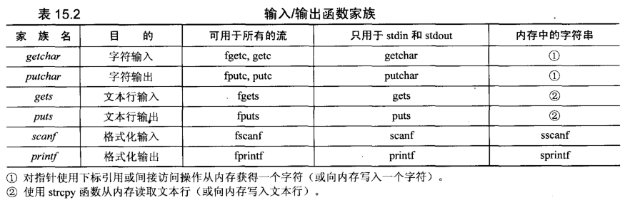
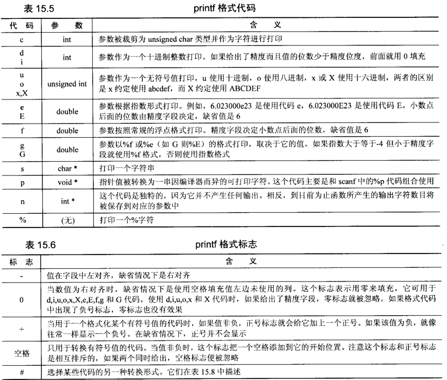
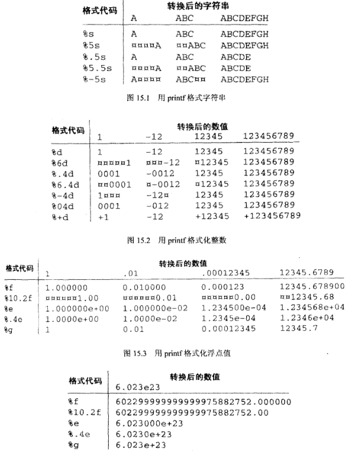

### **1. 错误报告**

```c
#include <errno.h>

void perror(char const *message);
```


- 如果message非空，打印这个字符，后面跟一个分号和空格，然后打印出用于解释errno当前错误代码的信息
- 只有当一个库函数失败的时候，errno才会被设置，不能通过测试errno的值来判断是否有错误发生
- 只有当被调用的函数提示有错误发生的时候才会检查errno的值才有意义


### **2. 终止执行**

```C
#include <stdlib.h>
void exit(int status);
```

- status参数返回给操作系统，用于提示程序是否完成
- 预定义符号`EXIT_SUCCESS`和`EXIT_FAILURE`分别提示程序的终止时成功还是失败
- 注意没有返回值


### **3. I/O**

#### **3.1 流**

- 绝大多数流是完全缓冲的，意味着读取和写入实际上是从一块被称为缓冲区的内存区域来回复制数据
- 用于输出流的**缓冲区**只有当它**写满时**才会被**刷新到设备或者文件**中，效率更高
- 一个常见的调试策略就是把一些输出printf函数散布于函数中，用于确定错误出现的具体位置，但是这些输出结果被写到缓冲区中，并不立即显示于大屏幕上。如果程序失败，缓存区可能不会被实际写入，出现错误位置不正确的结论，之后立即调用用fflush

```C
printf("something or other"); 
fflush(stdout);
```

- `fflush`迫使缓冲区的数据立即写入，不管是否已经写满


**流可以分为文本流和二进制流**

- 文本流
  - 文本行的最大长度标准规定至少允许254个字符
  - 文本行的结束方式以一个回车符和一个换行符结尾，UNIX中只适用一个换行符结尾
- 二进制流
  - 二进制流中的字节完全根据程序编写他们的形式写入到文件或者设备中
  - 完全根据他们从文件或设备读取的形式读入到程序中，未做任何改变
  - 适用于非文本数据


#### **3.2 文件**

- FILE是一个数据结构，用于访问一个流，如果同时激活几个流，每个流都有一个相应的FILE与它相关联
- 每个ANSI C程序，运行时必须有三个六：**标准输入(stdin)；标准输出(stdout)；标准错误(stderr)；**都是一个指向FILE的指针
- 输入输出重定向，`program < data > answer`从文件data而不是键盘作为标准输入进行读取，将标准输出写入到文件answer而不是屏幕上


#### **3.3 标准IO常量**

- **EOF**通常表示达到了文件的的末尾
- EOF选择的实际值比一个字符要多几位，为了避免二进制被错误的解释为EOF
- 一个程序最多能打开多少文件呢？与编译器有关，同时打开至少**FOPEN_MAX**个文件，这个常量包括了三个标准流，值至少是8
- **FILENAME_MAX**是一个整型值，用于提示一个字符数组应该多大以便容纳编译器所支持的最长合法文件名


### **4. 流I/O**

- 程序为必须同时处于活动状态的每个文件声明一个指针变量，类型为`FILE*`
- 流通过`fopen`函数打开。必须指定需要打开的文件或设备以及他们的访问方式(读，写，读写)
- `fclose`函数关闭流，防止与其相关联的文件被再次访问，保证任何存储于缓存区的数据被正确的写到文件中

- I/O函数以三种基本的形式处理数据：单个字符，文本行和二进制数据

- 执行字符、文本和二进制I/O的函数

| **数据类型** | **输入**       | **输出**       | **描述**                                             |
| ------------ | -------------- | -------------- | ---------------------------------------------------- |
| 字符         | getchar        | putchar        | 读取/写入单个字符                                    |
| 文本行       | gets <br>scanf | puts<br>printf | 文本行未格式化的输入（输出）<br>格式化的输入（输出） |
| 二进制数据   | fread          | fwrite         | 读取/写入二进制数据                                  |





### **5. 打开流**

```C
FILE *fopen(char const *name, char const *mode);
```


| **模式** | **描述**                                                     |
| -------- | ------------------------------------------------------------ |
| "r"      | 打开一个用于读取的文件。该文件必须存在。                     |
| "w"      | 创建一个用于写入的空文件。如果文件名称与已存在的文件相同，则会删除已有文件的内容，文件被视为一个新的空文件。 |
| "a"      | 追加到一个文件。写操作向文件末尾追加数据。如果文件不存在，则创建文件。 |
| "r+"     | 打开一个用于更新的文件，可读取也可写入。该文件必须存在。     |
| "w+"     | 创建一个用于读写的空文件。                                   |
| "a+"     | 打开一个用于读取和追加的文件。                               |

该函数返回一个 `FILE` 指针。否则返回` NULL`，且设置全局变量 `errno `来标识错误。

```C
FILE *input; 

input = fopen("data3", "r"); 
if(input == NULL) {    
    perror("data3");    
    exit(EXIT_FAILURE); 
}
```

```C
FILE *freopen(char const *filename, char const *mode, FILE *stream);
```


- `freopen()`函数用于文件流的的重定向，一般是将 `stdin`、`stdout` 和 `stderr` 重定向到文件。

- 所谓重定向，就是改变文件流的源头或目的地。`stdout`（标准输出流）的目的地是显示器，`printf()`是将流中的内容输出到显示器；可以通过`freopen()`将`stdout` 的目的地改为一个文件（如output.txt），再调用 `printf()`，就会将内容输出到这个文件里面，而不是显示器。 

- `freopen()`函数的原型为：

```C
  FILE *freopen(char *filename, char *type, FILE *stream);
```


- 【参数】`filename`为要重定向到的文件名；`type`为文件打开方式，请参考`fopen()`函数；`stream`为被重定向的文件流（一般是 stdin、stdout 或 stderr）。

- 【返回值】成功则返回指向`filename`文件的指针，否则返回`NULL`。

```C
#include<stdio.h> 

int main() {    
    if(freopen("D:\\OUTPUT.txt","w",stdout)==NULL)        
        printf("重定向出错");     
    
    printf("重定向成功");       
    fclose(stdout);    
    
    return 0; 
}
```

运行程序，如果重定向成功，D盘下会多出一个文件 OUTPUT.txt，文件内容为“重定向成功”。

### **6. 关闭流**

```C
int fclose(FILE *f);
```


- 对于输出流，在文件关闭之前刷新缓冲区，成功返回0，否得返回EOF

```C
#include <stdio.h> 

int main() {   
    FILE *fp;    
    fp = fopen("file.txt", "w");    
    fprintf(fp, "%s", "这里是 runoob.com");   
    fclose(fp);      
    
    return(0); 
}
```

让我们编译并运行上面的程序，这将创建一个文件 **file.txt**，然后写入下面的文本行，最后使用 **fclose()** 函数关闭文件。

这里是 runoob.com

### **7. 字符IO**

```C
// 字符输入 
int fgetc(FILE *stream); 
int getc(FILE *stream); 
int getchar(void); 

// 字符输出 
int fputc(int c, FILE *stream);	// 第一个参数是要被打印的字符 
int putc(int c, FILE *stream); 
int putchar(int c);
```

- `getchar`始终从标准输入读取，每个函数从流中读取下一个字符，并作为返回值返回，如果不存在更多的字符，返回EOF

```C
// 撤销字符IO 
int ungetc(int c, FILE *stream);
```

把字符 **char**（一个无符号字符）推入到指定的流 **stream** 中，以便它是下一个被读取到的字符。

```C
// 把一串从标准输入读取的数字转换为整数
#include <stdio.h>
#include <ctype.h>

int read_int(){
    int value;
    int ch;
    
    value = 0;
    
    // 转换从标准输入读入的数字，得到一个非数字字符时就终止
    while( (ch = getchar() ) != EOF && isdigit( ch ) ) {
        value *= 10;
        value += ch - '0';
    }
    
    // 将非数字字符回退到流中，这样就不会丢失
    ungetc( ch, stdin );
    return value;
}
```


### **8. 未被格式化的IO**

```C
char *fgets(char *buffer, int buffer_size, FILE *stream); 
char *gets(char *buffer); 

int fputs(char const *buffer, FILE *stream); 
int puts(char const *buffer);
```


- C 库函数 **`char *fgets(char *str, int n, FILE *stream)`** 从指定的流 stream 读取一行，并把它存储在 **`str`** 所指向的字符串内。当读取 **(n-1)** 个字符时，或者读取到换行符时，或者到达文件末尾时，它会停止，具体视情况而定。
- 如果成功，该函数返回相同的 str 参数。如果到达文件末尾或者没有读取到任何字符，str 的内容保持不变，并返回一个空指针。如果发生错误，返回一个空指针。

```C
#include <stdio.h> 

int main() {   
    FILE *fp;   
    char str[60];    
    
    /* 打开用于读取的文件 */   
    fp = fopen("file.txt" , "r");   
    if(fp == NULL) {      
        perror("打开文件时发生错误");      
        return(-1);   
    }   
    
    if( fgets (str, 60, fp)!=NULL ) {      
        /* 向标准输出 stdout 写入内容 */      
        puts(str);   
    }   
    
    fclose(fp);      
    
    return(0); 
} 

// 假设我们有一个文本文件 file.txt，它的内容如下。文件将作为实例中的输入： 
// We are in 2014 
// 产生结果 
// We are in 2014
```


- C 库函数 **int fputs(const char \*str, FILE \*stream)** 把字符串写入到指定的流 stream 中，但不包括空字符。
- 该函数返回一个非负值，如果发生错误则返回 EOF。
- 传递给fputs的缓冲区必须包含一个字符串，他的字符被写入到流中。逐字写入，若不含换行符就不会写入换行符，若包含好几个换行符，所有换行符都会被写入

```C
#include <stdio.h> 

int main () {   
    FILE *fp;    
    fp = fopen("file.txt", "w+");    
    fputs("这是 C 语言。", fp);   
    fputs("这是一种系统程序设计语言。", fp);    
    fclose(fp);      
    return(0); 
} 

// 编译并运行上面的程序，这将创建文件 file.txt，它的内容如下： 
// 这是 C 语言。这是一种系统程序设计语言。
```

- 常量`MAX_LINE_LENGTH`决定缓冲区的长度


```C
// 将标准输入读取的额文本行逐行复制到标准输出
#include <stdio.h>
#define MAX_LINE_LENGTH 1024

void copylines( FILE *input, FILE *output){
    char buffer[MAX_LINE_LENGTH];
    while( fgets( buffer, MAX_LINE_LENGTH, input ) != NULL )
        fputs( buffer, output );
}
```


### **9. 格式化的行I/O**

#### **9.1 scanf家族**

```C
int fscanf(FILE *stream, const char *format, ...)
```


-  从流 stream 读取格式化输入
- **stream** -- 这是指向 FILE 对象的指针，该 FILE 对象标识了流。
- **format** -- 这是 C 字符串，包含了以下各项中的一个或多个：空格字符、非空格字符 和 format 说明符。

format 说明符形式为 **[`=%[*][width][modifiers]type=`]**，具体讲解如下：

| 参数      | 描述                                                         |
| --------- | ------------------------------------------------------------ |
| *         | 这是一个可选的星号，表示数据是从流 stream 中读取的，但是可以被忽视，即它不存储在对应的参数中。 |
| width     | 这指定了在当前读取操作中读取的最大字符数。                   |
| modifiers | 为对应的附加参数所指向的数据指定一个不同于整型（针对 d、i 和 n）、无符号整型（针对 o、u 和 x）或浮点型（针对 e、f 和 g）的大小： h ：短整型（针对 d、i 和 n），或无符号短整型（针对 o、u 和 x） l ：长整型（针对 d、i 和 n），或无符号长整型（针对 o、u 和 x），或双精度型（针对 e、f 和 g） L ：长双精度型（针对 e、f 和 g） |
| type      | 一个字符，指定了要被读取的数据类型以及数据读取方式。具体参见下一个表格。 |

**fscanf 类型说明符：**

| 类型      | 合格的输入                                                   | 参数的类型     |
| --------- | ------------------------------------------------------------ | -------------- |
| c         | 单个字符：读取下一个字符。如果指定了一个不为 1 的宽度 width，函数会读取 width 个字符，并通过参数传递，把它们存储在数组中连续位置。在末尾不会追加空字符。 | char *         |
| d         | 十进制整数：数字前面的 + 或 - 号是可选的。                   | int *          |
| e,E,f,g,G | 浮点数：包含了一个小数点、一个可选的前置符号 + 或 -、一个可选的后置字符 e 或 E，以及一个十进制数字。两个有效的实例 -732.103 和 7.12e4 | float *        |
| o         | 八进制整数。                                                 | int *          |
| s         | 字符串。这将读取连续字符，直到遇到一个空格字符（空格字符可以是空白、换行和制表符）。 | char *         |
| u         | 无符号的十进制整数。                                         | unsigned int * |
| x,X       | 十六进制整数。                                               | int *          |

- **附加参数** -- 根据不同的 format 字符串，函数可能需要一系列的附加参数，每个参数包含了一个要被插入的值，替换了 format 参数中指定的每个 % 标签。参数的个数应与 % 标签的个数相同。

**返回值**

如果成功，该函数返回成功匹配和赋值的个数。如果到达文件末尾或发生读错误，则返回 EOF。

```C
#include <stdio.h> 
#include <stdlib.h>  

int main() {   
    char str1[10], str2[10], str3[10];   
    int year;   
    FILE * fp;    
    
    fp = fopen ("file.txt", "w+");   
    fputs("We are in 2014", fp);      
    rewind(fp);   
    
    fscanf(fp, "%s %s %s %d", str1, str2, str3, &year);      
    
    printf("Read String1 |%s|\n", str1 );   
    printf("Read String2 |%s|\n", str2 );   
    printf("Read String3 |%s|\n", str3 );   
    printf("Read Integer |%d|\n", year );    
    fclose(fp);      
    
    return(0); 
}
```

```
Read String1 |We| 
Read String2 |are| 
Read String3 |in| 
Read Integer |2014|
```

```C
int scanf(const char *format, ...)
```

- 从标准输入 stdin 读取格式化输入。
- **format** -- 这是 C 字符串，包含了以下各项中的一个或多个：*空格字符、非空格字符* 和 *format 说明符*。
- `[=%[*][width][modifiers]type=]`，具体讲解如下：

| **参数**  | **描述**                                                     |
| --------- | ------------------------------------------------------------ |
| *         | 这是一个可选的星号，表示数据是从流 stream 中读取的，但是可以被忽视，即它不存储在对应的参数中。 |
| width     | 这指定了在当前读取操作中读取的最大字符数。                   |
| modifiers | 为对应的附加参数所指向的数据指定一个不同于整型（针对 d、i 和 n）、无符号整型（针对 o、u 和 x）或浮点型（针对 e、f 和 g）的大小： h ：短整型（针对 d、i 和 n），或无符号短整型（针对 o、u 和 x） l ：长整型（针对 d、i 和 n），或无符号长整型（针对 o、u 和 x），或双精度型（针对 e、f 和 g） L ：长双精度型（针对 e、f 和 g） |
| type      | 一个字符，指定了要被读取的数据类型以及数据读取方式。具体参见下一个表格。 |

**scanf 类型说明符：**

| **类型**               | **合格的输入**                                               | **参数的类型** |
| ---------------------- | ------------------------------------------------------------ | -------------- |
| %a、%A                 | 读入一个浮点值(仅 C99 有效)。                                | float *        |
| %c                     | 单个字符：读取下一个字符。如果指定了一个不为 1 的宽度 width，函数会读取 width 个字符，并通过参数传递，把它们存储在数组中连续位置。在末尾不会追加空字符。 | char *         |
| %d                     | 十进制整数：数字前面的 + 或 - 号是可选的。                   | int *          |
| %e、%E、%f、%F、%g、%G | 浮点数：包含了一个小数点、一个可选的前置符号 + 或 -、一个可选的后置字符 e 或 E，以及一个十进制数字。两个有效的实例 -732.103 和 7.12e4 | float *        |
| %i                     | 读入十进制，八进制，十六进制整数 。                          | int *          |
| %o                     | 八进制整数。                                                 | int *          |
| %s                     | 字符串。这将读取连续字符，直到遇到一个空格字符（空格字符可以是空白、换行和制表符）。 | char *         |
| %u                     | 无符号的十进制整数。                                         | unsigned int * |
| %x、%X                 | 十六进制整数。                                               | int *          |
| %p                     | 读入一个指针 。                                              |                |
| %[]                    | 扫描字符集合 。                                              |                |
| %%                     | 读 % 符号。                                                  |                |

- **附加参数** -- 根据不同的 format 字符串，函数可能需要一系列的附加参数，每个参数包含了一个要被插入的值，替换了 format 参数中指定的每个 % 标签。参数的个数应与 % 标签的个数相同。
- 返回值：成功返回成功匹配与赋值的个数，如果到到文件末尾或者发生错误，返回EOF

```c
n=fcanf(input, "%4d %4d %4d %4d", &a, &b, &c, &d); 
// 参数宽度把整数值的宽度限制为4个数字或者更少
```

```C
// 从字符串读取格式化输入 
int sscanf(const char *str, const char *format, ...)
```


- **str** -- 这是 C 字符串，是函数检索数据的源。
- **format** -- 这是 C 字符串，包含了以下各项中的一个或多个：*空格字符、非空格字符* 和 *format 说明符*。

format 说明符形式为 **[=%[\*][width][modifiers]type=]**，具体讲解如下：

| 参数      | 描述                                                         |
| --------- | ------------------------------------------------------------ |
| *         | 这是一个可选的星号，表示数据是从流 stream 中读取的，但是可以被忽视，即它不存储在对应的参数中。 |
| width     | 这指定了在当前读取操作中读取的最大字符数。                   |
| modifiers | 为对应的附加参数所指向的数据指定一个不同于整型（针对 d、i 和 n）、无符号整型（针对 o、u 和 x）或浮点型（针对 e、f 和 g）的大小： h ：短整型（针对 d、i 和 n），或无符号短整型（针对 o、u 和 x）l ：长整型（针对 d、i 和 n），或无符号长整型（针对 o、u 和 x），或双精度型（针对 e、f 和 g） L ：长双精度型（针对 e、f 和 g） |
| type      | 一个字符，指定了要被读取的数据类型以及数据读取方式。具体参见下一个表格。 |

**sscanf 类型说明符：**

| 类型      | 合格的输入                                                   | 参数的类型     |
| --------- | ------------------------------------------------------------ | -------------- |
| c         | 单个字符：读取下一个字符。如果指定了一个不为 1 的宽度 width，函数会读取 width 个字符，并通过参数传递，把它们存储在数组中连续位置。在末尾不会追加空字符。 | char *         |
| d         | 十进制整数：数字前面的 + 或 - 号是可选的。                   | int *          |
| e,E,f,g,G | 浮点数：包含了一个小数点、一个可选的前置符号 + 或 -、一个可选的后置字符 e 或 E，以及一个十进制数字。两个有效的实例 -732.103 和 7.12e4 | float *        |
| o         | 八进制整数。                                                 | int *          |
| s         | 字符串。这将读取连续字符，直到遇到一个空格字符（空格字符可以是空白、换行和制表符）。 | char *         |
| u         | 无符号的十进制整数。                                         | unsigned int * |
| x,X       | 十六进制整数。                                               | int *          |

- **附加参数** -- 这个函数接受一系列的指针作为附加参数，每一个指针都指向一个对象，对象类型由 format 字符串中相应的 % 标签指定，参数与 % 标签的顺序相同。

针对检索数据的 format 字符串中的每个 format 说明符，应指定一个附加参数。如果您想要把 sscanf 操作的结果存储在一个普通的变量中，您应该在标识符前放置引用运算符（&），例如：

```C
int n; 
sscanf (str,"%d",&n);
```

**返回值**

如果成功，该函数返回成功匹配和赋值的个数。如果到达文件末尾或发生读错误，则返回 EOF。

```C
// 用sscanf处理行定向的输入

#include <stdio.h>
#define BUFFER_SIZE 100

void function(FILE *input){
	int a,b,c,d,e;
    char BUFFER[BUFFER_SIZE];
    
    while(fgets(buffer, BUFFER_SIZE, input)!=NULL){
        if(sscanf(buffer, "%d %d %d %d %d", &a, &b, &c, &d, &e) != 5)
            fprintf(stderr, "Bad input skipped: 5s", buffer );
        continue;
    }
}
```

```C
// 用sscanf处理可变格式的输入

#include <stdio.h>
#include <stdlib.h>

#define DEFFULT_A 1
#define DEFFULT_B 2

void function( char *buffer ){
    int a, b, c;
    
    // 看看三个值是否都给出了
    if(sscanf(buffer, "%d %d %d", &a, &b, &c) != 3){
        // 否，对a使用缺省值，看看其他两个值是否给出
        a = DEFAULT_A;
        if(sscanf(buffer, "%d %d", &b, &c) != 2){
        	// b使用缺省值
            if(sscanf(buffer, "%d", &c) != 1){
                fprintf(stderr, "Bad input : %s", buffer);
                exit(EXIT_FAILURE);
            }
        }
    }
}
```


#### **9.2 printf家族**

```C
int fprintf(FILE *stream, char const *format, ...); 
int printf(char const *format, ...); 
int sprintf(char *buffer, char const *format, ...);
```


- `printf`结果送到标准输出
- `fprintf`可以使用任何输出流
- `sprintf`将其结果作为一个以`NUL`结尾的字符串存储到指定的`buffer`缓冲区而不是写入到流中

```C
#include <stdio.h> 
#include <math.h> 

int main() {    
	char str[80];    
    sprintf(str, "Pi 的值 = %f", M_PI);    
    puts(str);    
    return(0); 
} 

// 输出 Pi 的值 = 3.141593
```





### **10. 二进制I/O**

```C
size_t fread(void *ptr, size_t size, size_t nmemb, FILE *stream)
```

- 从给定流 **stream** 读取数据到 **ptr** 所指向的数组中
- **ptr** -- 这是指向带有最小尺寸 `size*nmemb` 字节的内存块的指针。
- **size** -- 这是要读取的每个元素的大小，以字节为单位。
- **nmemb** -- 这是元素的个数，每个元素的大小为 size 字节。
- **stream** -- 这是指向 FILE 对象的指针，该 FILE 对象指定了一个输入流。
- 成功读取的元素总数会以 size_t 对象返回，size_t 对象是一个整型数据类型。如果总数与 nmemb 参数不同，则可能发生了一个错误或者到达了文件末尾。


```C
size_t fwrite(const void *ptr, size_t size, size_t nmemb, FILE *stream)
```

- 把 **ptr** 所指向的数组中的数据写入到给定流 **stream** 中
- **ptr** -- 这是指向要被写入的元素数组的指针。
- **size** -- 这是要被写入的每个元素的大小，以字节为单位。
- **nmemb** -- 这是元素的个数，每个元素的大小为 size 字节。
- **stream** -- 这是指向 FILE 对象的指针，该 FILE 对象指定了一个输出流。
- 如果成功，该函数返回一个 size_t 对象，表示元素的总数，该对象是一个整型数据类型。如果该数字与 nmemb 参数不同，则会显示一个错误。

### **11. 刷新和定位函数**

```
int fflush(FILE *stream)
```

- 刷新流 stream 的输出缓冲区。
- **stream** -- 这是指向 FILE 对象的指针，该 FILE 对象指定了一个缓冲流。
- 如果成功，该函数返回零值。如果发生错误，则返回 EOF，且设置错误标识符（即 feof）。
- 迫使一个输入流的缓冲区内的数据进行物理写入


```C
long int ftell(FILE *stream)
```

- 返回给定流 stream 的当前文件位置。也就是下一个读取或者写入将要开始的位置距离文件起始位置的偏移量
- **stream** -- 这是指向 FILE 对象的指针，该 FILE 对象标识了流。
- 该函数返回位置标识符的当前值。如果发生错误，则返回 -1L，全局变量 errno 被设置为一个正值。

```C
#include <stdio.h> 

int main () {   
    FILE *fp;   
    int len;   
    fp = fopen("file.txt", "r");   
    
    if( fp == NULL )    {      
        perror ("打开文件错误");      
        return(-1);   
    }   
    
    fseek(fp, 0, SEEK_END);   
    len = ftell(fp);   
    fclose(fp);   
    printf("file.txt 的总大小 = %d 字节\n", len);   
    
    return(0); 
}
```

假设我们有一个文本文件 file.txt，它的内容如下： This is runoob.com 结果： file.txt 的总大小 = 19 字节


```C
int fseek(FILE *stream, long int offset, int whence);
```

- 设置流 **stream** 的文件位置为给定的偏移 **offset**，参数 offset 意味着从给定的 **whence** 位置查找的字节数。
- **stream** -- 这是指向 FILE 对象的指针，该 FILE 对象标识了流。

- **offset** -- 这是相对 whence 的偏移量，以字节为单位。
- **whence** -- 这是表示开始添加偏移 offset 的位置。它一般指定为下列常量之一：

| **常量** | **描述**           |
| -------- | ------------------ |
| SEEK_SET | 文件的开头         |
| SEEK_CUR | 文件指针的当前位置 |
| SEEK_END | 文件的末尾         |

- 如果成功，则该函数返回零，否则返回非零值。


```C
void rewind(FILE *stream); 
int fgetpos(FILE *stream, fpos_t *position); 
int fsetpos(FILE *stream, fpos_t const *position);
```

- `rewind`函数将读写指针设置回指定流的起始位置，同时清除流的错误提示标志
- `fgeepos`和`fsetpos`分别是`ftell`和`fseek`的替代函数

### **12. 改变缓冲方式**

```C
void setbuf(FILE *stream, char *buf);
```

- `setbuf`设置了另一个数组，用于对流进行缓冲，这个数组的字符长度必须为BUFSIZ
- 为一个流设置缓冲区可以防止I/O函数库为其分配一个缓冲区
- 若NULL参数调用这个函数，`setbuf`函数将关闭流的所有缓冲方式


```C
int setvbuf(FILE *stream, char *buf, int mode, size_t size);
```

- mode指定缓冲类型
- _IOFBF指定一个完全缓冲的流
- _IONBF指定一个不缓冲的流
- _IOLBF指定一个行缓冲流，就是当一个换行符写入到缓冲区时，就进行刷新
- buf和size用于指定需要使用的缓冲区，buf为NULL，size为0。最好使用BUFSIZ长度的字符数组作为缓冲区

### **13. 流错误函数**

```
int feof(FILE *stream); 
int ferror(FILE *stream); 
void clearerr(FILE *stream);
```

- 流处于文件末尾，feof为真
- ferror报告流的错误状态，出现任何读写错误返回真
- clearerr函数对指定流的错误标志进行重置

### **14. 临时文件**

临时保存数据的文件，程序结束就删除

```C
FILE *tmpfile(void);
```

- 文件以wb+模式打开。

### **15. 文件操纵函数**

```C
int remove(char const *filename);
```

- 删除一个指定的文件

```C
int rename(char const *oldname, char const *newname);
```

- 改变一个文件的名字